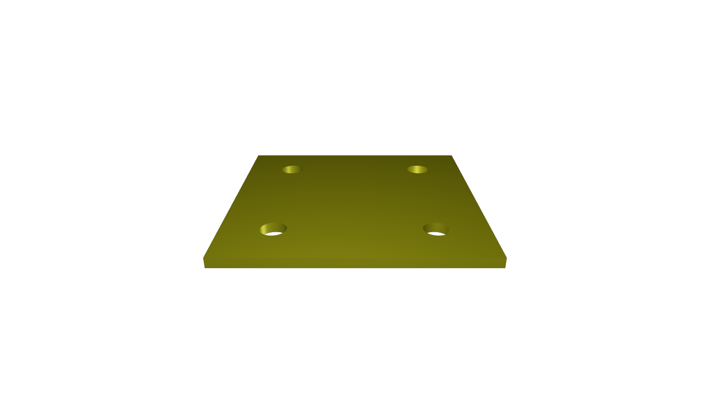

# ToolCRIB

**Say the joint. Get the joint.**

ToolCRIB is an open-source **trust layer for AI-generated CAD**, built on the
[Zoo.dev](https://zoo.dev) APIs for the Zoo API Makeathon (July 22 – August 5, 2026).

## Read this first

What this produces is a starting point, not a finished decision. **Nothing here has
been tested, approved, or signed off by anybody, and nothing in this repo has been
graded against anything.** What it does is propose numbers and write down where each
one came from: where a published document gave us a number we cite it by paragraph and
mark the row unchecked until a person has read that source and signed it off; where no
published document exists we say so and cite our own bench work on one named printer.

If the part you print matters — it holds a load, it takes heat, somebody gets hurt when
it breaks — check the numbers against your own source first. Whether a finished part is
fit for the job it is going into is a call for the person holding that part. It is not a
call a generator can make, and it is not made by the citation printed next to a number.

## See it run (60 seconds, no install, no API key)

```bash
git clone <this repo>
cd toolcrib
npm run demo   # the whole loop, offline: no network, no API minutes, no install step
```

One real request walks the entire machine — validation → cited reference consult →
generation (replayed from real prior Zoo outputs) → measured geometry gates → a
hash-sealed job package → parked at a gate that waits for a human. It ends by printing
that job's transition ledger, re-verified end to end, and the state it stopped in:

```
  ·                        -> DRAFT                    [SYS:pipeline-orchestrator] created
  DRAFT                    -> VALIDATING               [SYS:pipeline-orchestrator] request file: samples/requests/plain-plate.json
  VALIDATING               -> GENERATING               [SYS:request-validator] request valid
  GENERATING               -> GEOMETRY_CHECK           [SYS:pipeline-orchestrator] replay backend produced kcl(2469B) + files [stl, step, gltf, png]; 2 reference rule lookup(s) — DRAFT — NOT VERIFIED
  GEOMETRY_CHECK           -> PACKAGING                [SYS:pipeline-orchestrator] gates: envelope=pass, watertight=pass, mass=pass; measured {"bboxMm":{"x":50,"y":50,"z":2},"watertight":true,"volumeMm3":4843.9277,"triangles":540,"massG":13.0786}
  PACKAGING                -> PDF_GENERATION           [SYS:pipeline-orchestrator] exports sealed at server/pipeline/data/packages/4049aa72-c50b-4c92-a919-92abddca3258 (packageHash 8fb0dc8c2a11c25771828a3a0ce22ff95deaa754b900e57a68e1e00e3ebfe030)
  PDF_GENERATION           -> WAITING_FOR_HUMAN_REVIEW [SYS:pipeline-orchestrator] manufacturingPackage.pdf rendered (16407B); parked for human review
  ledger verify: OK (7 rows, hash chain intact)

final state: WAITING_FOR_HUMAN_REVIEW
```

That is pasted from a real run of this repo, not retyped. The job id and the
`packageHash` are minted fresh on every run, so those two will differ for you; the rest
is what you get. Every row is hash-chained to the one before it, and the last line is
the chain being recomputed and checked rather than asserted.

And the part it built — the engine-rendered preview the run seals into the package,
byte-identical to the copy shipped here:



What is inside that sealed package, what the leak sweep does, and how to point the same
pipeline at the live API are in [Setup](#setup).

## The problem

Modern text-to-CAD is remarkable at *shapes* and still hard to trust for *features that
fasten things together*. Joints, bolt patterns, holes, countersinks, flush mounting —
these are native, first-class operations in a real CAD kernel, but they are the exact
places where a prompt-to-mesh tool quietly gets it wrong: an edge distance too tight, a
countersink angle nobody specified, a hole pattern that drifted. If those features were
as easy to **say** as they are to model, AI CAD would be a manufacturing tool instead of
a demo.

ToolCRIB attacks that gap two ways:

1. **A codified fastening reference.** Machine-readable rules and tables for holes,
   fasteners, edge distances, and flush mounting, derived from public-domain FAA
   acceptable-practice data (AC 43.13-1B) — the kind of shop knowledge that normally
   lives in a dog-eared binder, exposed as a typed backend reference with every value
   carrying its source citation. The pipeline asks the reference about every request
   that passes validation, and gets an answer when the request is a prose prompt in mm
   that states the hole size in mm just before the word *holes*, with nothing in between
   but an optional *diameter* or *dia.* — the demo's `four 5mm diameter holes` is the
   shape it reads, and `four 5mm holes` reads the same. Anything else comes back
   empty: a request built from structured fields carries no prompt to read at all,
   and a prompt that words it another way — `four holes of 5mm`, `5 mm bolt holes` —
   is not recognised. Either way the ledger row written once the files
   come back records which it was — the lookup count, or `reference consult skipped:`
   and the reason. A request rejected at validation never gets that far.
   `npm run amend` checks a clearance against it. (The flush-mount generator does
   not — it builds from the numbers you hand it. That boundary is stated again below,
   where the generator is.)
2. **A traceable generate → validate → document → revise loop.** Intent goes in; Zoo's
   Agent API drafts editable parametric CAD (KCL, not a dead mesh); Zoo's Engine API
   executes and *validates* it (mass properties, geometry checks); Zoo's File Format API
   exports STL/STEP; and the output ships as a documented package a stranger could
   pick up, reproduce, and remix — with a human approval gate before anything is made.
   The **revise** leg is the newest and the least finished of the four, and this README
   says exactly where it stops: a human at the gate can request a revision, and
   [`npm run amend`](#when-the-print-comes-back-wrong-npm-run-amend) computes what the
   revised request should say from a caliper reading — but nothing re-enters the machine
   automatically yet.

The demo part is small on purpose. The pattern is the product.

## Zoo API usage (verified as we go — nothing claimed that hasn't run)

| Capability | Status | Notes |
|---|---|---|
| Bearer-token auth (`GET /user`) | ✅ verified 2026-07-22 | `Authorization: Bearer <token>` |
| Text-to-CAD (`POST /ai/text-to-cad/{format}?kcl=true`) | ✅ verified 2026-07-22 | async; returns constraint-based, parametric KCL 2.0 — genuinely editable |
| STEP export | ✅ verified 2026-07-22 | via `/async/operations/{id}` outputs (see FN-007); glTF preview comes free |
| Engine mass/volume validation (`/file/mass`) | ✅ verified 2026-07-22 | API mass matched hand calc to 0.02% (FN-008) |
| Agent copilot session (`/ws/ml/copilot`) | ✅ verified 2026-07-23 | full agent round-trip in 49 s: KCL gen → lint → execute → snapshot → analysis (FN-026..028) |
| Engine modeling commands (websocket) | ✅ verified 2026-07-22 | post-upgrade `headers` auth (FN-013); ~50 ms round-trips (FN-014) |
| Engine bounding box | ✅ verified 2026-07-22 | cube → exact dims via `bounding_box` (FN-015); null for imported objects (FN-022) |
| DXF export (`export2d`) | ✅ verified 2026-07-22 | real AC1014 ASCII DXF in ~54 ms (FN-016) |
| Render/preview PNG | ✅ verified 2026-07-23 | import → `zoom_to_fit` → `take_snapshot`, ~2.5 s (FN-022) |
| Round-trip re-import of own exports | ❌ broken | `internal_engine: import failed`; glTF fixable by stripping Zoo's own extension (FN-023) |

Running findings, bugs, and doc gaps are logged in
[`docs/API_FIELD_NOTES.md`](docs/API_FIELD_NOTES.md).

## The first tool: say the joint, get the joint

`server/generators/flushmount.mjs` generates a **flush-mount pair** — panel with a
chamfered opening plus the insert that sits flush in it — from a parameter spec:
clearance per side (a number you supply — the generator does not look it up; the fit
table's bands are what
[`npm run amend`](#when-the-print-comes-back-wrong-npm-run-amend) checks a clearance
against), 45° lead-in chamfers sized `≥ 2 × clearance`, optional rear registration
lip, each part in its own color so the fit reads visually. Output is
remixer-friendly KCL 2.0: your numbers are named constants, every derived dimension
carries its formula as a comment, and the generator refuses to emit geometry that
violates its own arithmetic gates. Printable fit-coupon sets at four clearances live
in `samples/flush-mount/coupons/`. (A **coupon** is a machinist's word for a small
test piece you make to check one thing before committing to the real part — nothing
to do with discounts. Print the set, try the fits, keep the one that felt right.)

Why deterministic generation instead of prompting? Campaign C003 (FN-020): text-to-cad
*can* build this pair — when the prompt pre-chews the engineering. Phrase it like a
machinist ("0.3 mm total clearance") and it fails outright; phrase it casually and you
get silently different geometry — with no API signal telling you which you got.

## When the print comes back wrong: `npm run amend`

The generator gets you a part. The bench tells you whether it fit. This is the other
half — one command, offline, no API minutes, nothing installed:

```bash
npm run amend
```

It walks one bench story end to end. A flush-mount pair printed at 0.15 mm clearance
per side; the calipers say the opening came out 0.10 mm smaller than the model; the
insert binds going in. That story is a **worked example and the output says so**: the
geometry is real (it is `samples/flush-mount/pair-rect-c0.15`, executed on the Zoo
engine), the caliper reading is a stated scenario nobody took with real calipers, and
everything downstream of the reading is computed for real. Out the other end comes an
amended request, and every number in it is labelled one of two ways:

- **cited** — a row of the fit table holds exactly this number. The rule id and the
  full citation string are printed beside it, and the number is passed through
  unrounded so it stays the table's and not ours.
- **computed** — our arithmetic, printed in full, with a warning saying plainly that
  no row in the reference authorises it. Turning a caliper reading into a clearance
  is this tool's own reasoning. The band is cited; the correction is not.

Then it does the part that is hard to argue with. It runs the real generator on the
parent request and on the amended one, and prints the sha256 of all four KCL programs:

```
panel    parent 67d2b9f9…   amended 67d2b9f9…   IDENTICAL
insert   parent e7684ef9…   amended 9aeb7c74…   DIFFERS
```

The panel program is byte-identical because the hole in the panel is the size it
always was — clearance is not a value a panel emitter even reads. The insert moved:
`clearancePerSide = 0.15mm` became `clearancePerSide = 0.2mm`, and the further lines
that moved with it are that one parameter's consequences — the derived insert
dimensions the generator writes out as comments, and the profile coordinates KCL
carries as literal numbers. Not one of them is a second decision, and the output
counts and classifies them so you can see that rather than take it on faith. **The
amendment touched exactly the part it should and nothing else** — and you do not have
to take that on trust, because the hashes are printed and the whole diff is printed
under them. (Had the correction needed a deeper lead-in chamfer, the panel would have
moved too, and should have: the panel carries that chamfer as well. Byte-identical
here is a measurement, not a rule.)

Every fit-table row this leans on is still unsigned, so the proposal comes back
watermarked `DRAFT — NOT VERIFIED` with the pending rows named. That is the
fail-closed reference doing its job, not an oversight.

**What it does not do, plainly.** `server/revision/amend.mjs` is a pure module — no
I/O, no ledger, no state, no network. It is **not** wired into the HTTP API and
**not** wired into the review console, and the pipeline runner does **not** drive the
`REVISION_REQUESTED -> DRAFT` edge that opens a new revision. That edge is real code
rather than a plan: the state map carries it (`server/state/states.mjs:77`) and the
store bumps the job's `rev` when a caller walks it (`server/state/store.mjs:171`,
exercised end to end by `server/state/state.test.mjs:66`). But the only caller that
walks it today is that test. The console's *Request revision* button parks a job at
`REVISION_REQUESTED` and stops there. Wiring the amendment onto that edge is the next
increment; why the module shipped before the wiring is D-009 in
[`docs/DECISION_LOG.md`](docs/DECISION_LOG.md).

So: a real, runnable artifact with real hashes — and not a closed loop. Both halves
of that sentence are load-bearing.

## The reliability harness (the night shift)

Because a `completed` status is not proof of correct geometry (FN-006: the same
fastening prompt failed 2 of 3 runs), this repo measures instead of assumes. A
**campaign** is a designed grid of prompts — one question, N identical repeats per
case, every completed output pushed through the mass-validation gate:

```bash
npm run campaign -- c001-fastening-reliability --dry   # show the plan (free)
npm run campaign -- c001-fastening-reliability         # run it (backgroundable)
```

Each run writes a `ledger.jsonl` (one line per generation), per-run KCL, and a
`summary.md` with pass rates, latency spread, and spend — including the category the
status field cannot see: **completed_invalid**, where Zoo said done but the geometry
is wrong. Add your own experiment by copying
[`server/harness/campaigns/_template.mjs`](server/harness/campaigns/_template.mjs);
the runner, budget cap, and stats come free.

## Status

Built entirely inside the contest window — every line of code and every
measurement. See [`docs/CURRENT_STATE.md`](docs/CURRENT_STATE.md) for what works
right now and when it landed.

## Setup

The command is at the top of this file —
[See it run](#see-it-run-60-seconds-no-install-no-api-key). This section is what it
leaves behind.

`npm run demo` parks its job at the human-review gate and writes a hash-sealed package
beside it: CAD source, STL/STEP, engine-rendered preview, validation report, 13-section
manufacturing PDF, tamper-evident manifest. No token needed, and nothing to install:
every import under `server/` is a `node:` builtin, so the demo has zero npm dependencies
and runs against an empty `node_modules`. (Node versions below.)

The bundle is a nested directory, so count it recursively — `find <bundle> -type f` gives
**12 files across six subdirectories, 11 of them sealed**. (A plain `ls` of the top level
shows 10 entries: four files and those six directories.) `manifest.json` hashes the 10
artifacts in `manifest.files` — two beside it, the other eight under `cad/`, `exports/`,
`previews/`, `reports/`, `logs/` and `approvals/` — into one recomputable `packageHash`,
and is the eleventh file. The twelfth is `notifications.log` — the parked-for-review
line, appended *after* the seal by `server/pipeline/run-job.mjs`, so it is deliberately
outside the hash and is not a manifest entry. Nothing inside the seal can change without
`dodCheck` catching it.

That seal is also written into the ledger, in full: the `PACKAGING -> PDF_GENERATION`
row's reason carries the whole 64-hex `packageHash`, and that row is hash-chained like
every other. Since `generationRequest.json` is one of the sealed files, the chain
therefore commits to the exact request bytes the part was built from — change the
request after the fact and the manifest, the seal in the ledger, and the chain from that
row forward all have to be forged together.

`npm run leak-audit` (also the last step of `npm test`) sweeps every tracked file — and,
with `--bundle=<dir>`, a generated job bundle — for four things: a filesystem path that names
a **person** (a drive root, a UNC share, a home directory — a machine-rooted path that names
nobody, like `/var/tmp/scratch`, deliberately passes), an account identifier, a BOM, and CRLF
in a committed blob. It plants a control leak of *every one of those kinds* in its own corpus
first, and refuses to report *clean* unless all four come back reported.

A second sweep, in the same spirit, checks the docs rather than the data. Every
`file:line` citation in this README, `docs/ARCHITECTURE.md`, `docs/DECISION_LOG.md`,
the amendment module and the printed output of `npm run amend` has to name a line that
still holds the text it was cited for (`server/lib/doc-citations.mjs`, run as part of
`npm test`). Insert a line near the top of a cited file and the citations that now point
one line past the thing they name go red instead of going quietly wrong. **If you add a
citation to one of those documents, the suite will ask you to pin it** — that is the
check working, and the failure message says which file to add it to.

**If you downloaded the ZIP instead of cloning, six tests will fail — and that is them
doing their job.** All six belong to that same safety check. Three of them read every
file in the project — two looking for personal information left behind by mistake, one
for the line-ending problem — and the other three check that the reader itself still
behaves. Every one of the six starts by asking `git` for the list of files, and a ZIP
download has no `git` information inside it. With no list, not one of them will report
all-clear over files it never opened, so five of the six stop with

```
git ls-files failed (exit 128) — the sweep cannot verify what it cannot list.
```

and the sixth, which checks line endings, makes the same complaint in its own words:

```
git ls-files --eol failed (exit 128) — the committed line endings cannot be verified.
```

A check that cannot see what it is checking should say so out loud, not pass quietly.
A failure of this shape never means something was found — the check stops before it
reads anything, so it has nothing to report either way. Nothing else is affected:
`npm run demo` still exits 0 in a ZIP. To get a fully green `npm test`, take the code
with `git clone` rather than the ZIP button, and run it again.

With a Zoo token in `.env` (`cp .env.example .env`), the same pipeline runs live:

```bash
TOOLCRIB_ALLOW_LIVE=1 node server/pipeline/run-job.mjs samples/requests/plain-plate.json --backend=live
```

## Run the review console

The console is the one part of this repo that *does* have dependencies, so it gets one
install of its own — the demo above stays install-free either way:

```bash
npm --prefix app install     # console deps (React + Vite); the demo needs none of this
npm start                    # API on :8787 — the only server process that holds a Zoo token
npm --prefix app run dev     # console on :5173, dev proxy to the API
```

The API binds `127.0.0.1` and nothing else, with no environment override — an
unauthenticated approval gate does not belong on a LAN. On top of that, the two routes
that change state (`POST /api/jobs` and the human decision route) require
`content-type: application/json` and refuse any `Origin` that is not the console. That
second pair is not belt-and-braces: a plain HTML form on any page you happen to have
open can POST to a localhost port, the same-origin policy does not stop a form
submission, and the CORS block governs who may *read* a response, which a form does not
need to do. `server/api/server.mjs` carries the reasoning, including the deliberate call
on a request with no `Origin` at all (curl, scripts — admitted, and why). Remove any one
of the three and `server/api/listen.test.mjs` or the forgery guards in
`server/api/api.test.mjs` go red.

Open `http://localhost:5173`. The job list reads the same flat-file data directory
the CLI writes, so `npm run demo` and `npm run job` runs already show up before you
create anything new. Job detail is the transition ledger as centerpiece — every row
hash-chained, with a "ledger verified ✓ (hash chain intact)" badge (or a loud failure
if a row was ever tampered with) — followed by gate cards (threshold vs. measured,
per gate), the package panel (every file with its own sha256 and a download link,
plus the full packageHash), and, once a job reaches the human-review gate, a review
bar that requires a named human before Approve or Request revision does anything.

## Node versions (declared floor, and the one we actually ran)

The two halves of this repo do not share a floor, so they are stated separately —
and separately from the version this build has been executed on, which is the only
number here that comes from a run rather than a manifest.

| | Declared floor | Where that number comes from |
|---|---|---|
| `npm run demo` + `npm test` | `>=22.6` | `package.json` `engines`; set by the `--experimental-strip-types` step `npm test` uses for the console self-checks |
| `npm --prefix app run dev` / `run build` | `^20.19.0 \|\| >=22.12.0` | Vite's own `engines`, read off the installed `vite@8.1.5` |

**Executed:** `npm test` (0 failures), `npm run demo` (exit 0, `ledger verify: OK`),
and `npm --prefix app run build` (clean) all ran on **Node 24.16.0**. That is the
runtime this build is verified on. Older runtimes are untested here — including the
two declared floors above, which are declarations, not measurements. If you need a
lower floor confirmed, run it and tell us; we won't claim a version we haven't
executed.

Note the gap the two rows create: Node 22.6–22.11 satisfies `engines` and runs the
test suite, but sits below Vite's 22.12 cutoff, so it will not run the console.

## Drafting with Zookeeper (operator mode)

The console's second tab is a natural-language drafting chat with **Zookeeper**,
Zoo's ML copilot, over its websocket (`wss://api.zoo.dev/ws/ml/copilot`). Describe
a part in prose, watch the copilot reason and draft KCL live, then push a finished
turn into the New Job form as design intent — the reviewed pipeline underneath
(gates, ledger, human sign-off) is exactly the same pipeline this panel feeds.

The token boundary is a hard rule, not an implementation detail. **The token is entered
at runtime, held in memory only, and talks from your browser straight to Zoo — wiped
the moment you disconnect.** That part is in the code: `app/src/lib/zookeeper.ts`
sends it once in the auth frame and clears its copy immediately. The ToolCRIB backend
has zero involvement in this path — there is no proxy, and we refused to build one on
purpose: a proxy would let anonymous visitors run billable agent sessions under our
identity, which breaks the per-session metering honesty (`api_call_id` = one Zoo API
call per turn) the rest of this repo is built around.

**Hosting policy, stated as policy.** This console is not hosted anywhere today — the
repo carries no deploy configuration of any kind — and the rule for if it ever is: a
public deployment stays replay-only, with no token field and no live sessions. Only a
local operator run connects a browser to Zoo. Be clear about the status of that rule:
it is an operator commitment, **not** something the build enforces. There is no
production guard on the Zookeeper panel and no build flag that strips it, so a naive
`npm --prefix app run build` ships the token field. Anyone who hosts this is the one
enforcing the policy, and wiring a real gate is the prerequisite for doing so.

## Beyond fastening: the same pattern, two more domains

Two extra items from the backlog (`docs/backlog/BL-003`, `BL-004`) point the same
pattern — a rule with its source printed beside it, a check that either passes or
refuses, and a plain statement of what the answer is not — at two more problems.

**Read these two as side tools, because that is what they are.** Each has its own
command, its own tests and its own pass/fail sample pair, and neither one is on the
`npm run demo` path: nothing under `server/pipeline/` imports either module, and the
pipeline runs exactly three checks on a part — does it fit the printer, is the mesh
closed, does it weigh what the request said. Neither of these is one of them.

**Design-for-flammability** (`server/reference/tables/burn-cert.mjs`,
`server/generators/burncert-validate.mjs`; **burn-cert** is shorthand for *burn
certification* — the lab test where a real piece of the real plastic is set alight to
see whether it meets a published flammability standard, and nothing in this repo is
that test) turns published wall-thickness findings
(FAA TC TN23-65 / UL-94) into a wall-thickness check over an STL: it samples points
on the mesh and measures how thick the plastic is there, against the floor the table
names. `server/generators/burncert-recipe.mjs` (`printRecipe`) writes out the half a
CAD file cannot control — material, minimum infill, print orientation. Run it
yourself on the pair in [`samples/burn-cert/`](samples/burn-cert/) (commands in that
folder's README): the 2.0 mm plate passes, and the same plate at 0.8 mm fails and
exits 1. Nothing here certifies anything — that takes a physical coupon burned in a
lab per 14 CFR 25.853 — and every rule ships stamped as unverified until a person
signs it off.

**Assembly weight & balance** (`server/wb/`, and **W&B** wherever the code shortens it)
adds up an assembly's parts and works out where the combined **center of gravity (CG)**
lands — the single point the whole thing balances about. It labels each part's mass `modeled`
(computed from the volume and a density you give it) or `measured` (you weighed it on
a kitchen scale, which wins), and the report says which one each row used. Give it a
window the CG has to stay inside and the check is fail-closed: land outside it and
`assemblyWB` raises `CgWindowError` instead of returning anything, so there is no
report to skim past. Be exact about what that refuses — **a weight-and-balance
report, not a job package.** No job, no ledger row, nothing sealed: `assemblyWB` is a
function, and the only two callers in this repo are its own test file and its own
runner, `node server/wb/run-wb-demo.mjs`. The pair in
[`samples/wb-demo/`](samples/wb-demo/) is that runner's real output, and it is what
shows the check works: one assembly inside the window, written up as a passing
report, and the same assembly with the ballast slid outboard, where the check refused
and the refusal is what got written instead.

## Safety note

It is at the top of this file, on purpose — [Read this first](#read-this-first). The
short version: nothing here has been tested, approved, or signed off by anybody, and
if the part you print matters, check the numbers against your own source first.

## License

MIT — see [LICENSE](LICENSE).
